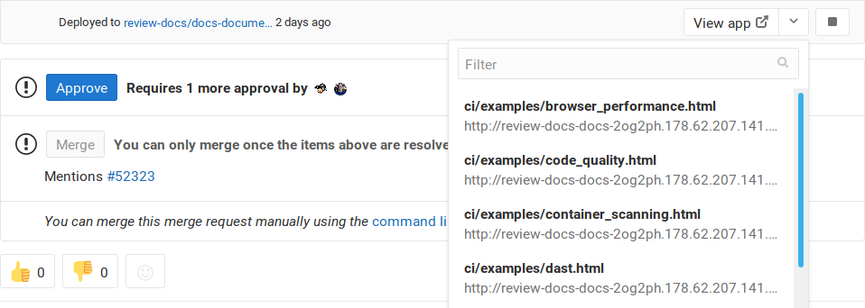

# Review Apps

> - [Introduced](https://gitlab.com/gitlab-org/gitlab-ce/issues/21971) in GitLab 8.12. Further additions were made in GitLab 8.13 and 8.14.
> - Inspired by [Heroku's Review Apps](https://devcenter.heroku.com/articles/github-integration-review-apps), which itself was inspired by [Fourchette](https://github.com/rainforestapp/fourchette).

Review Apps is a collaboration tool that takes the hard work out of providing an environment to showcase product changes.

## Introduction

Review Apps:

- Provide an automatic live preview of changes made in a feature branch by spinning up a dynamic environment for your merge requests.
- Allow designers and product managers to see your changes without needing to check out your branch and run your changes in a sandbox environment.
- Are fully integrated with the [GitLab DevOps LifeCycle](../../README.md#the-entire-devops-lifecycle).
- Allow you to deploy your changes wherever you want.


In the above example:

- A Review App is built every time a commit is pushed to `topic branch`.
- The reviewer fails two reviews before passing the third review.
- Once the review as passed, `topic branch` is merged into `master` where it's deploy to staging.
- After been approved in staging, the changes that were merged into `master` are deployed in to production.

### How Review Apps work

A Review App is a mapping of a branch with an [environment](../environments.md).
Access to the Review App is made available as a link on the [merge request](../../user/project/merge_requests.md) relevant to the branch.

The following is an example of a merge request with an environment set dynamically.


In this example, a branch was:

- Successfully built.
- Deployed under a dynamic environment that can be reached by clicking on the **View app** button.

## Configuring Review Apps

Review Apps are built on [dynamic environments](../environments.md#configuring-dynamic-environments), which allow you to dynamically create a new environment for each branch.

The process of configuring Review Apps is as follows:

1. Set up the infrastructure to host and deploy the Review Apps.
1. [Install](https://docs.gitlab.com/runner/install/) and [configure](https://docs.gitlab.com/runner/commands/) a Runner to do deployment.
1. Set up a job in `.gitlab-ci.yml` that uses the [predefined CI environment variable](../variables/README.md) `${CI_COMMIT_REF_NAME}` to create dynamic environments and restrict it to run only on branches.
1. Optionally, set a job that [manually stops](../environments.md#stopping-an-environment) the Review Apps.

### Examples

The following are example projects that demonstrate Review App configuration:

- [NGINX](https://gitlab.com/gitlab-examples/review-apps-nginx).
- [OpenShift](https://gitlab.com/gitlab-examples/review-apps-openshift).

See also the video [Demo: Cloud Native Development with GitLab](https://www.youtube.com/watch?v=jfIyQEwrocw), which includes a Review Apps example.

### Route Maps

> Introduced in GitLab 8.17. In GitLab 11.5, the file links are available in the merge request widget.

Route Maps allows you to go directly from source files
to public pages on the [environment](../environments.md) defined for
Review Apps.

Once set up, the review app link in the merge request
widget can take you directly to the pages changed, making it easier
and faster to preview proposed modifications.

Configuring Route Maps involves telling GitLab how the paths of files
in your repository map to paths of pages on your website using a Route Map.
Once set, GitLab will display **View on ...** buttons, which will take you
to the pages changed directly from merge requests.

To set up a route map, add a a file inside the repository at `.gitlab/route-map.yml`,
which contains a YAML array that maps `source` paths (in the repository) to `public`
paths (on the website).

#### Route Maps example

The following is an example of a route map for [Middleman](https://middlemanapp.com),
a static site generator (SSG) used to build [GitLab's website](https://about.gitlab.com),
deployed from its [project on GitLab.com](https://gitlab.com/gitlab-com/www-gitlab-com):

```yaml
# Team data
- source: 'data/team.yml' # data/team.yml
  public: 'team/' # team/

# Blogposts
- source: /source\/posts\/([0-9]{4})-([0-9]{2})-([0-9]{2})-(.+?)\..*/ # source/posts/2017-01-30-around-the-world-in-6-releases.html.md.erb
  public: '\1/\2/\3/\4/' # 2017/01/30/around-the-world-in-6-releases/

# HTML files
- source: /source\/(.+?\.html).*/ # source/index.html.haml
  public: '\1' # index.html

# Other files
- source: /source\/(.*)/ # source/images/blogimages/around-the-world-in-6-releases-cover.png
  public: '\1' # images/blogimages/around-the-world-in-6-releases-cover.png
```

Mappings are defined as entries in the root YAML array, and are identified by a `-` prefix. Within an entry, there is a hash map with two keys:

- `source`
  - A string, starting and ending with `'`, for an exact match.
  - A regular expression, starting and ending with `/`, for a pattern match:
    - The regular expression needs to match the entire source path - `^` and `$` anchors are implied.
    - Can include capture groups denoted by `()` that can be referred to in the `public` path.
    - Slashes (`/`) can, but don't have to, be escaped as `\/`.
    - Literal periods (`.`) should be escaped as `\.`.
- `public`, a string starting and ending with `'`.
  - Can include `\N` expressions to refer to capture groups in the `source` regular expression in order of their occurrence, starting with `\1`.

The public path for a source path is determined by finding the first
`source` expression that matches it, and returning the corresponding
`public` path, replacing the `\N` expressions with the values of the
`()` capture groups if appropriate.

In the example above, the fact that mappings are evaluated in order
of their definition is used to ensure that `source/index.html.haml`
will match `/source\/(.+?\.html).*/` instead of `/source\/(.*)/`,
and will result in a public path of `index.html`, instead of
`index.html.haml`.

Once you have the route mapping set up, it will take effect in the following locations:

- In the merge request widget. The:
  - **View app** button will take you to the environment URL set in `.gitlab-ci.yml`.
  - Dropdown will list the first 5 matched items from the route map, but you can filter them if more
    than 5 are available.

    

- In the diff for a merge request, comparison, or commit.

    

- In the blob file view.

    

## Working with Review Apps

After adding Review Apps to your workflow, you follow the branched Git flow. That is:

1. Push a branch and let the Runner deploy the Review App based on the `script` definition of the dynamic environment job.
1. Wait for the Runner to build and deploy your web application.
1. Click on the link that provided in the merge request related to the branch to see the changes live.

### Visual Reviews

The Visual Reviews feedback form can be added to a Review App to enable reviewers to post comments
directly from the app back to the merge request that spawned the Review App.

For example, a form like the following can be configured to post the contents of the
text field into the discussion thread of a merge request:


#### Using Visual Reviews

If Visual Reviews has been [enabled](#configuring-visual-reviews) for the Review App, the Visual Reviews feedback form is overlaid on the app's pages at the bottom-right corner.

To use the feedback form, you will need to create a [personal access token](../../user/profile/personal_access_tokens.md) with the API scope selected.

Paste the token into the feedback box, when prompted. If you select **Remember me**, your browser stores the token so that future visits to Review Apps at the same URL will not require you to re-enter the token. To clear the token, click **Log out**.

Because tokens must be entered on a per-domain basis and they can only be accessed once, we recommend saving the token to your password manager specifically for the purpose of Visual Reviews. This way, you will not need to create additional tokens for each merge request.

Comments can make use of all the [Markdown annotations](../../user/markdown.md)
available in merge request comment boxes.

#### Configuring Visual Reviews

The feedback form is served through a script you add to pages in your Review App.
To access the code to include the script, click the **Review** button in the **Pipeline** section of the merge request.


The provided script hardcodes the project and merge request IDs. You may want to consider
using features of your programming language to use environment variables or other
means to inject these at runtime.

Future enhancements will make this process even easier.

## Limitations

Review App limitations are the same as [environments limitations](../environments.md#limitations).
